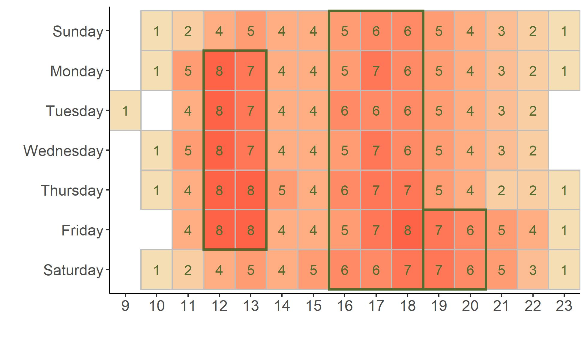
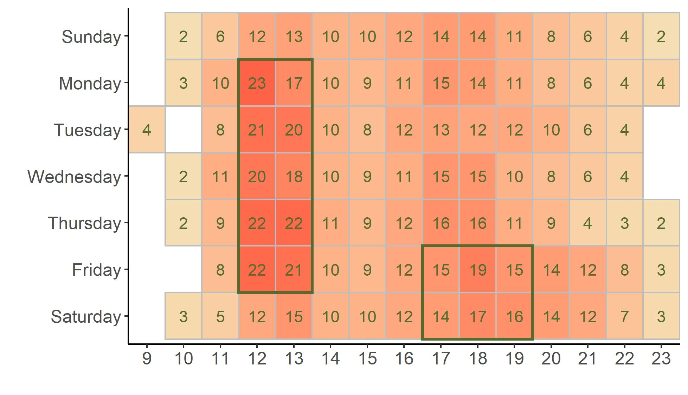
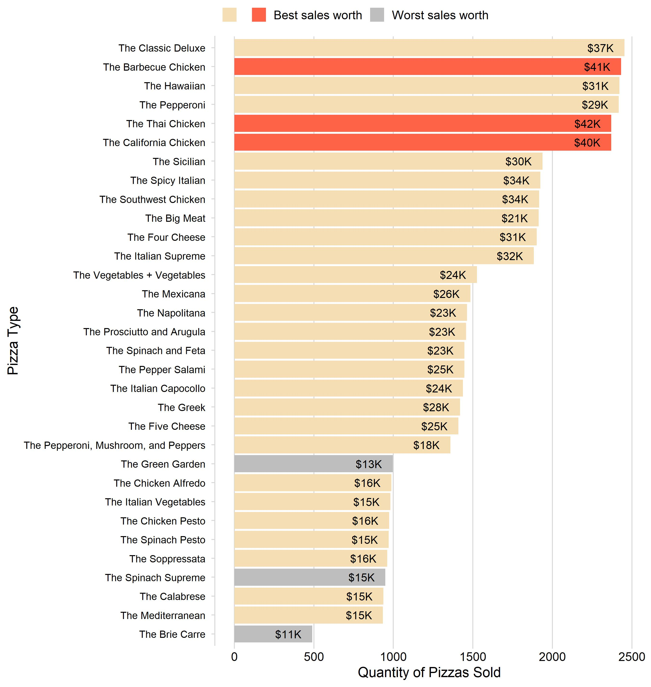
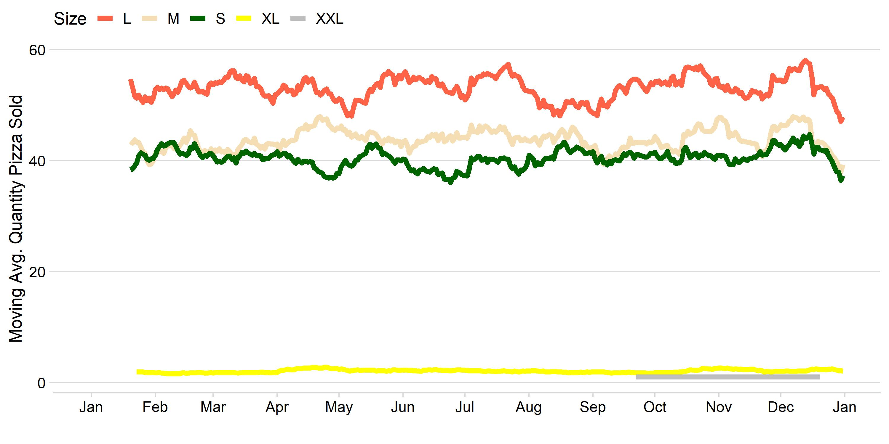

```{r setup, include=FALSE}
library(flexdashboard)

# KPI's

load("objects.RData")

```

```{css}

.value-output {
  color: #A9A9A9;
}

.caption {
  color: black;
  font-size: 150
}


```

Column {data-width=150}
-------------------------------------

### Orders vs Revenue
```{r}
valueBox(value = "",
         color = "#FFE4C4",
         caption = "")

```

### total orders
```{r}
valueBox(value =  prettyNum(as.numeric(t.orders), big.mark = ","), 
         color = "#F5F5DC",
         icon = "fa-list",
         caption = "Total Orders")

```


### revenue
```{r}
valueBox(value = paste0("$",prettyNum(as.numeric(revenue), big.mark = ",")), 
         color = "#F5F5DC",
         icon = "fa-dollar-sign",
         caption = "Revenue")

```

### revenue per order
```{r}
valueBox(value = paste0("$",prettyNum(as.numeric(avg.order), big.mark = ",")), 
         color = "#F5F5DC",
         icon = "fa-dollar-sign",
         caption = "Avg. Revenue per order")

```

### Production

```{r}
valueBox(value = "",
         color = "#FFE4C4",
         caption = "")

```

### total pizzaa
```{r}
valueBox(value = prettyNum(as.numeric(t.pizzas), big.mark = ","), 
         color = "#F5F5DC",
         icon = "fa-utensils",
         caption = "Total Pizzas sold")

```

### Dif pizza
```{r}
valueBox(value =  prettyNum(as.numeric(types.pyzze), big.mark = ","), 
         color = "#F5F5DC",
         icon = "fa-hashtag",
         caption = "Pizza flavors")

```

### categories
```{r}
valueBox(value = prettyNum(as.numeric(categories), big.mark = ","), 
         color = "#F5F5DC",
         icon = "fa-filter",
         caption = "Pizza categories")

```

### Number of ingredients
```{r}
valueBox(value = prettyNum(as.numeric(ingredients), big.mark = ","), 
         color = "#F5F5DC",
         icon = "fa-list",
         caption = "Different ingredients")

```

### Mean of ingredients per pizza
```{r}
valueBox(value = prettyNum(as.numeric(n.ingredients), big.mark = ","), 
         color = "#F5F5DC",
         caption = "Avg ingredients per Pizza flavor")

```


Column {data-width=450}
-------------------------------------
### Average Orders per Hour and Day

######## The busiest hours of the pizzeria, in terms of the average number of orders, are between **12pm** and **2pm** and between **4pm** and **7pm**. On **Fridays** and **Saturdays** orders remain high until **9pm**

```{r, out.width="95%", out.height="50%"}




```


### Average Pizzas per Hour and Day

######## From **Monday** to **Friday**, between noon and **2 am**, approximately **20** pizzas are sold per hour, which is equivalent to  **one** pizza every **3** minutes. Are pizzaiolos or ninjas working in the kitchen?  
######## It is worth mentioning that despite the high number of orders between 4 pm and 7 pm shown in the previous chart, the lower number of pizzas sold suggests that at **these times people do not go to the pizzeria in large groups, such as at lunchtime**.

```{r, out.width="95%", out.height="50%"}




```


Column 
-------------------------------------
### Pizza types

######## it is intersting to note that the three most sold  pizzas, in terms of total revenue, are the **Chicken** type ones. 

######## **The Classic Deluxe** is the best  selling type of pizza in terms of quantity and **The Thai Chicken** is the type with the highest revenue.

######## **The Green Garden**, **The Spinach Supreme** and **The Brie Carre** are not doing so well in terms of revenue. 


```{r, out.width="95%", out.height="65%"}

```

Column 
-------------------------------------

### Size pizza's sold

######## The moving average of the daily quantity of pizzas sold shows us that **XL** and **XXL** sell little. **Large** pizzas are preferred, followed by medium and small.

```{r, out.width="100%", out.height="65%"}

```

### Ingredients
######## The most used ingredients in 2015 were **Tomatoes**, which was present in **74%** of the sold pizzas, **Garlic**, **Mozzarela Cheese**,  **Pepperoni** and **Red Onions** and the least used were **Caramelized Onion**, **Pears** and **Thyme**, all were present in only **1%** of the sold pizzas.

```{r, out.width="88%", out.height="20%"}
knitr::include_graphics("graphics/WorldCloud.jpeg")

```


